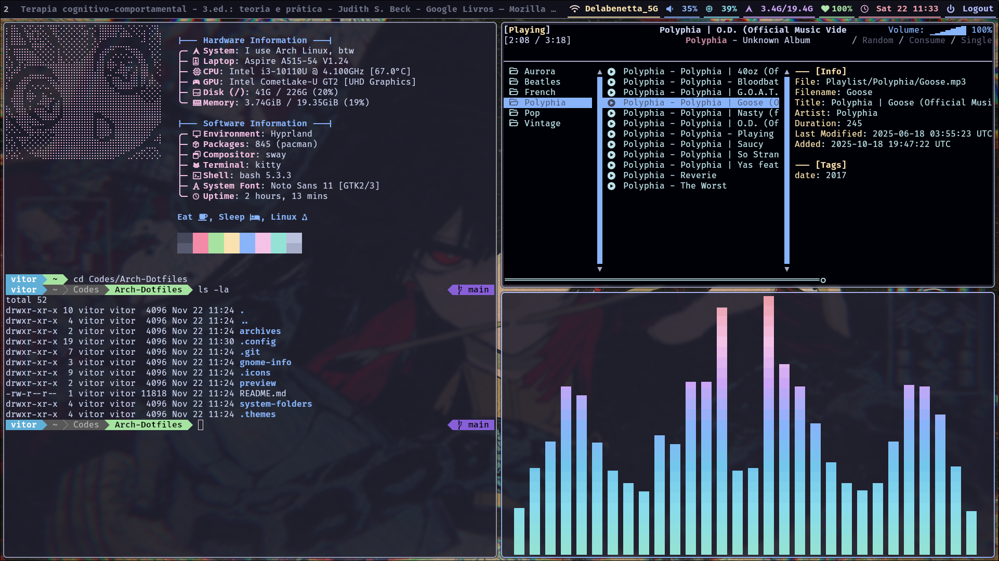
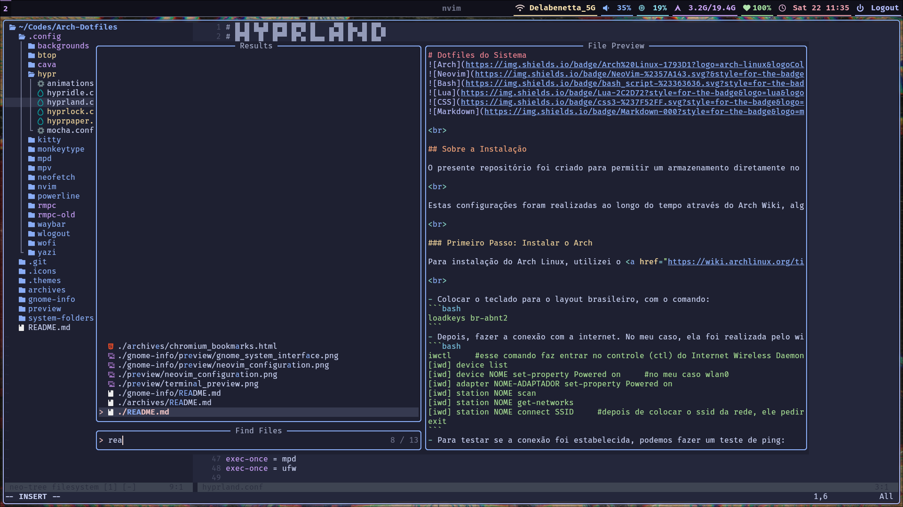
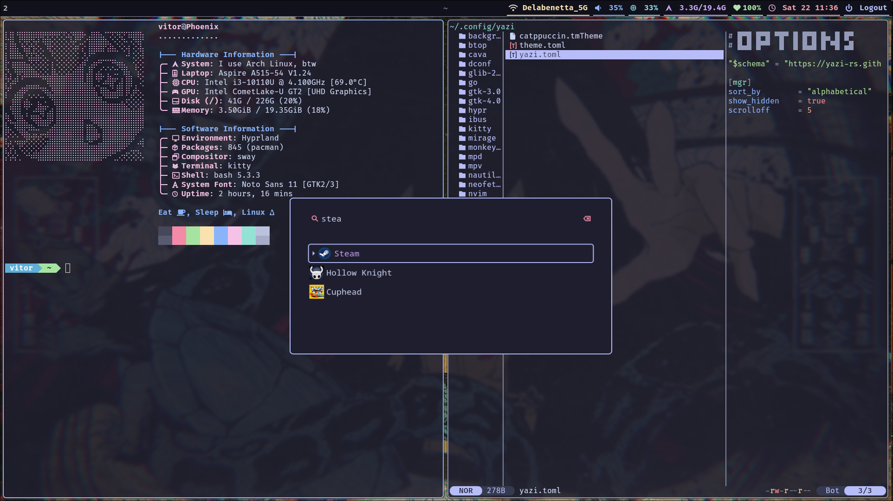
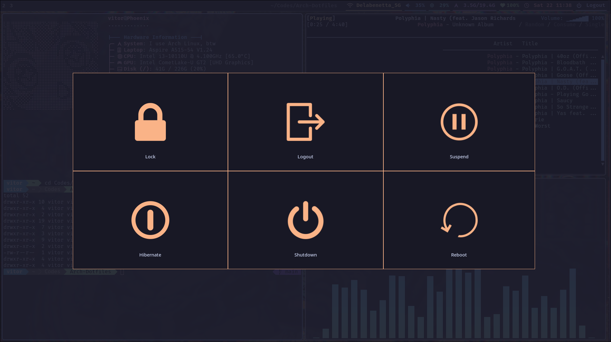

<div align="center">

# Configurações do Arch


Neste repositório constam algumas configurações gerais e passos para instalação e interface do Arch Linux, bem como para configurar alguns programas no mesmo - como o Terminal, Neofetch, RMPC, etc.

</div>

<br>

> [!NOTE]
> Estas configurações foram realizadas ao longo do tempo através do Arch Wiki, algumas ideias de Ricing através do Reddit e vários outros através de vídeos no YouTube. A configuração do Hyprland e do Neovim foram feitas seguindo as séries de vídeos do <a href="https://www.youtube.com/playlist?list=PLsz00TDipIffreIaUNk64KxTIkQaGguqn" target="_blank">Typecraft</a> - com várias modificações que acabei fazendo, pois melhor convinham para mim.

<br>

## Pré-Visualização

 

 

---

## Guia de Instalação e Configuração

- Índice dos Conteúdos:

  > [Primeiro Passo: Instalação do Arch](#primeiro-passo)
  > 
  > > Conexão de internet via wi-fi
  > >
  > > Formatação das partições
  > >
  > > Instalação dos pacotes principais
  > >
  > > Configuração do horário e linguagem
  > >
  > > Configuração do usuário e host
  > 
  > [Segundo Passo: Escolha da interface visual](#segundo-passo)
  >
  > > Instalação do Gnome ou KDE
  > > 
  > > Instalação do Hyprland
  >
  > [Terceiro Passo: Estilização e Configurações](#terceiro-passo)
  >
  > > Download dos Dotfiles
  > >
  > > Estilização dos programas

---

## Primeiro Passo

Para instalação do Arch Linux, utilizei o <a href="https://wiki.archlinux.org/title/Installation_guide">Guia de Instalação</a> da própria archwiki. Após baixar uma imagem do sistema operacional em .iso e fazer a preparação do pendrive bootável, começamos a instalação do Arch - conforme o passo a passo completo da wiki.

<br>

Colocar o teclado para o layout brasileiro, com o comando:
```bash
loadkeys br-abnt2
```
Depois, fazer a conexão com a internet. No meu caso, ela foi realizada pelo wi-fi:
```bash
iwctl     #esse comando faz entrar no controle (ctl) do Internet Wireless Daemon
[iwd] device list
[iwd] device NOME set-property Powered on     #no meu caso wlan0
[iwd] adapter NOME-ADAPTADOR set-property Powered on
[iwd] station NOME scan
[iwd] station NOME get-networks
[iwd] station NOME connect SSID     #depois de colocar o ssid da rede, ele pedirá a senha
exit
```
Para testar se a conexão foi estabelecida, podemos fazer um teste de ping:
```bash
ping -c 5 google.com
# Ctrl + C para parar o teste
# Ctrl + L para limpar a tela, sempre que necessário
```

<br>

Com o teclado e internet funcionando, começamos a instalação. O primeiro passo é a criação/formatação das partições:
```bash
lsblk     #para listar as partições
cfdisk /dev/nvme0n1     #no meu caso, para abrir o gerenciador da partição do disco
```
Uma vez dentro da partição, teremos que fazer a deleção de todos os "Devices" listados. Para isso, movemos com a seta do teclado para cima da opção Delete e pressionamos o Enter.

Feito a deleção, começamos a criar as novas partições:

> Primeiro, damos New e colocamos o tamanho como "100M" - partição usada para o boot.
> 
> Depois, novamente New e colocamos o tamanho de "8G" - partição que será usada para memória virtual.
> 
> Por fim, damos um New e pressionamos o Enter para criar uma última partição com o restante do tamanho - usada para o armazenamento.
>
> Tendo feito isso, vamos até a opção Write, digitamos "yes" e pressionamos o Enter. Após, podemos ir no Quit.

<br>

> [!IMPORTANT]
> É importante criar as partições nessa ordem, para facilitar o próximo passo.

<br>

Tendo criado as partições, podemos iniciar a formatação das mesmas. Para isso, fazemos:
```bash
lsblk     #para listar as partições
mkfs.ext4 /dev/nvme0n1p3     #formato ext4 para arquivos do Linux
mkfs.fat -F 32 /dev/nvme0n1p1     #formato F32 para alocação de arquivos
mkswap /dev/nvme0n1p2     #formato swap, para movimentar entre RAM e Armazenamento
```
Depois de formatadas corretamente, podemos fazer a montagem das mesmas:
```bash
mount /dev/nvme0n1p3 /mnt     #colocamos a partição no diretório de montagem padrão para o root
swapon /dev/nvme0n1p2
mkdir -p /mnt/boot/efi     #para criar o próximo diretório
mount /dev/nvme0n1p1 /mnt/boot/efi
lsblk     #para listar as partições e validar se os formatos ficaram corretos
```

<br>

Tendo as partições, fazemos a instalação dos packages essenciais. Para isso, teremos:
```bash
pacstrap /mnt base linux linux-firmware sof-firmware base-devel grub efibootmgr vim networkmanager
```
Após a instalação, temos que fazer a geração do arquivo que define como as partições serão montadas no boot do sistema:
```bash
genfstab /mnt
genfstab /mnt > /mnt/etc/fstab
cat /mnt/etc/fstab     #para ver se realmente as informações de montagem estão lá
```

<br>

Em seguida, podemos entrar no nosso sistema e configurar a linguagem e horário:
```bash
arch-chroot /mnt     #entra dentro do sistema com o root
ln -sf /usr/share/zoneinfo/America/Sao_Paulo etc/localtime
hwclock --systohc
date     #para verificar se o horário está correto

vim /etc/locale.gen     #para definir a linguagem
```
Dentro do arquivo do "locale.gen", podemos pesquisar a linha com as informações de "#pt_BR.UTF-8 UTF8" e tirar o comentário da frente. Caso quiser outra linguagem para o sistema, a mesma pode ser definida descomentando a linha. No meu caso, deixarei a linguagem como "en_US.UTF8 UTF8" para deixar o sistema em inglês.

Tendo feito isso, salvamos o arquivo e digitamos o seguinte no terminal:
```bash
locale-gen     #para gerar o locale

vim /etc/locale.conf
```
Dentro desse outro arquivo, definimos também a linguagem digitando a linha "LANG=pt_BR.UTF-8".\
No meu caso, deixarei como "LANG=en_US.UTF-8".

Após isso, podemos definir também o layout do teclado. Faremos:
```bash
vim /etc/vconsole.conf 
```
Dentro do arquivo do "vconsole.conf", adicionamos o layout brasileiro com a linha "KEYMAP=br-abnt2".

<br>

Seguidamente, podemos definir qual será o nome da nossa máquina. Para isso, teremos:
```bash
vim /etc/hostname
```
Dentro desse arquivo, colocaremos qualquer nome que quisermos dar para a nossa máquina. No meu caso, colocarei como "Phoenix".

<br>

Por fim, podemos definir a senha do usuário root e criar nosso próprio usuário:
```bash
passwd
#colocar a senha

useradd -m -G wheel -s /bin/bash NOME     #no meu caso, o nome será "vitor"
passwd vitor
#colocar a senha
```
Precisaremos colocar também nosso usuário dentro do grupo wheel para rodar comandos com sudo. Assim:
```bash
EDITOR=vim visudo
```
Precisaremos tirar o comentário da linha "%wheel ALL=(ALL) ALL" no final do arquivo, abaixo da linha que fala "Uncomment to allow members of group wheel to execute any command".

Para testar, podemos salvar o arquivo e digitar no terminal:
```bash
su vitor
sudo pacman -Syu
#colocar a senha
```
Ao final destas configurações, antes de fazer o reboot, faremos ainda:
```bash
exit     #para sair do nosso usuário
systemctl enable NetworkManager
grub-install /dev/nvme0n1
grub-mkconfig -o /boot/grub/grub.cfg

exit     #para sair do root e voltar ao terminal com cor vermelha
umount -a
reboot     #tirar o pendrive do boot
```

<br>

> [!WARNING]
> Podemos já configrar os repositórios para podermos rodar aplicações de 32 bit em nosso sistema:
> ```bash
> sudo vim /etc/pacman.conf
> ```
> Neste arquivo, tiramos o comentário da frente do "#[multilib]" e do "#Include = /etc/pacman.d/mirrorlist", logo abaixo.

<br>

## Segundo Passo

Após entrar dentro do Arch pela primeira vez, podemos conferir a conexão com a internet para baixar os primeiros utilitários. No meu caso, estarei utilizando como interface gráfica o Hyprland e como terminal o Kitty. Nesse passo, sinta-se livre para escolher o melhor Desktop Environment para o seu sistema (gnome, plasma, cinnamon, etc).

<br>

Primeiro, estabelecer a conexão com a internet. No meu caso, via Network Manager:
```bash
nmcli radio wifi on
nmcli device wifi list
nmcli device wifi connect SSID password SENHA

ping google.com     #para testar se está conectando corretamente
```
Agora, faremos a instalação dos nossos utilitários mais importantes:
```bash
sudo pacman -S kitty     #para o terminal
sudo pacman -S nautilus     #para o explorador de arquivos
sudo pacman -S nvim     #para edição de textos
sudo pacman -S firefox     #para internet
```
Por fim, colocaremos a nossa DE (esse passo será diferente para o plasma, gnome e outros):
```bash
sudo pacman -S plasma sddm     #para realizar a instalação do plasma
sudo systemctl enable --now ssddm
```
```bash
sudo pacman -S xorg xorg-server     #para realizar a instalação do gnome
sudo pacman -S gnome gdm gnome-tweaks
sudo pacman -Qs gdm     #primeiro verificamos se o display manager está funcionando
sudo systemctl enable --now gdm.service
```
```bash
sudo pacman -S hyprland [display manager]     #para realizar a instalação do hypr e de algum DM (no meu caso, utilizo o ly)
```
Após instalar, podemos reiniciar o computador e logar na sessão.\
Caso opte pelo Hyprland, sua seleção no sddm fica na parte superior, ao lado da linguagem. No gdm, selecionamos clicando no ícone de engrenagem na parte inferior direita e escolhendo dentre as opções.

<br>

## Terceiro Passo

Depois que a instalação do sistema estiver realizada e todo o básico estiver feito, podem ser realizadas as configurações dos programas principais e as estilizações. Para isso, primeiro é preciso realizar o download do repositório atual contendo os arquivos de configuração. Isso pode ser feito via a instalação do Git e dado continuidade com a clonagem do repositório um diretório local de preferência:

<br>

1. Após instalar o Git, vá até a página inicial do repositório do projeto;
2. Selecione a opção "<> Code";
3. Copie o link HTTPS do projeto. Pode ser criada a configuração de uma chave SSH para melhor controle de versionamento via Git também;
4. Escolha um local de preferência na sua máquina ou crie um diretório onde o projeto ficará;
5. Clone o repositório utilizando o comando "git clone LINK", do seguinte modo:
```bash
git clone https://github.com/VitorDelabenetta/Dotfiles.git     # utilizando https
git clone git@github.com:VitorDelabenetta/Dotfiles.git     # utilizando ssh
```

<br>

Os arquivos de configuração ficarão dentro da pasta anônima ".config", que deve ser criada na Home do computador. O mesmo serve para as demais pastas (.icons, .themes, etc).\
Para aplicar as configurações, apenas deve ser movido o arquivo para sua pasta correta.

<br>

A pasta "system-folders" contém dois arquivos principais: o bashrc, que deve estar dentro da Home; e o arquivo do Neofetch, que deve estar dentro da pasta root do sistema e em /usr/bin. Também estão presentes os arquivos de configuração do Display Manager Ly e as configurações do Hollow Grub.

<br>
