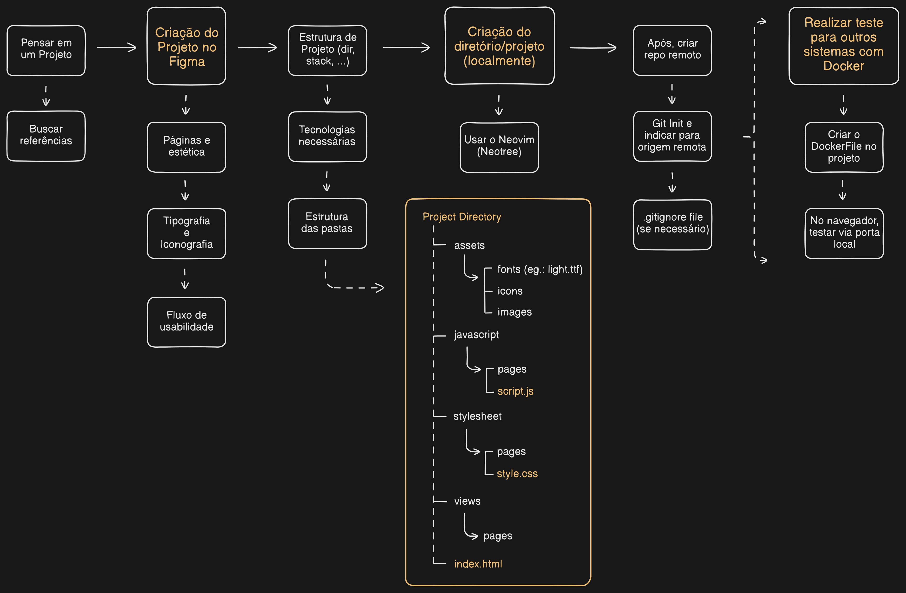

## Arquivos Gerais

Esta pasta possui alguns arquivos e informações úteis para a utilização do Arch Linux e para a construção de projetos (sobretudo projetos Front-End). Neste documento, também deixo alguns comandos e atalhos que facilitam a minha usabilidade - você provavelmente irá querer criar as suas próprias configurações.

<br>

### Apresentação dos Arquivos

Um dos arquivos que está presente aqui é o <i>projects_structure.png</i>. Como faço alguns projetos básicos de Front-End nas minhas horas livres (que são poucas), tenho esse padrão que sigo de estruturação e organização das pastas.

<br>



<br>

### Comandos

Ao utilizar o Arch com uma tiling window manager como o Hyprland, acabamos nos acostumando a não ter de sair do terminal para nossas operações diárias.\
Além de aumentar a produtividade por agilizar as operações e não gastar tantos recursos da máquina, temos um maior controle dos processos através do teclado. Assim, nos acostumamos a criar shortcuts para navegar entre janelas, arquivos e programas.

<br>

<blockquote>
    Linux Terminal
</blockquote>

```bash
ctrl + l: clear
pwd: print work directory
ls -a: list content (with hidden files)

uptime -s: show the time it was booted

mkdir [name]: make directory
mkdir -p [name]/{subdirname-1,subdirname-2}: make directories and subdirectories
touch [file.extension]: create file

rm [filename]: remove file
rm -r [directory]: remove directory
mv [filename] [new filename]: rename file
mv [filename] ./directory: move file

&&: use more than one command at time (eg.: mkdir Teste && cd Teste)
```

<br>

<blockquote>
    Arch Linux Terminal
</blockquote>

```bash
yay -P --stats: verify the data of the packages installed

> Wifi Configuration
nmcli radio wifi on: set wifi on
nmcli radio wifo off: set wifi off
nmcli device wifi list: list available networks
nmcli device wifi connect "SSID" password "SENHA": connects to a specific network
# Caso não funcionar com a função acima, utilizar o seguinte:
nmcli device wifi connect "SSID" --ask

> Brightnessclt
brightnessctl s 50%: set the screen brightness at half total
brightnessctl s +10%: elevate the brightness in 10
brightnessctl s -10%: diminish the brightness in 10

> Wf-Recorder | MPV
sudo pacman -S wf-recorder
sudo pacman -S mpv
# Para realizar gravações:
wf-recorder -f [name file].mp4 #start recording (end with ctrl + c)
mpv [name file].mp4 #run the video

> Hollow Grub
yay -S hollow-grub
# Select theme with:
sudo /boot/grub/themes/hollow-grub/theme_selector.sh
```

<br>

<blockquote>
    Neovim Commands
</blockquote>

```bash
h: left
j: down
k: up
l: right

:Tutor (for tutorials)
:help (for commands, instructions, errors - example ":help E37")

# observação: comandos precedidos por números informam quantidades 
# (ex.: ":3x" deleta três letras)

x: delete character
d + w: delete selected word
dd: delete entire line
u: redo one delete
y: yanks to clipboard

o: inserts a line over the cursor
O: inserts a line above the cursor
Shift + v: select lines

w: inicial of next word
b: previous word
e: end of next word

%: finds a matchpair for (), [] or {}

G: goes to end of file or specific line (ex.: the "10G" goes to line 10)
gg: goes to the start of file

Ctrl + w + v: split window verticaly
Ctrl + w + l: goes to the left open window
Ctrl + w + h: goes to the right open window
```

<br>

<blockquote>
    Browser Commands
</blockquote>

```bash
> Firefox
alt + [left arrow]: goes to the previous page
alt + [right arrow]: goes to the forward page

ctrl + shift + page up: move tab to left
ctrl + shift + page down: move tab to right

shift + esc: firefox tabs task manager (view ressources)

> Vimium
f: open the selection options
Shift + f: open selection, but opens in new tab
j: goes down
k: goes up
gg: scroll to the top
G: scroll to the bottom

r: reload
yy: yank the url (copy)

/: search mode (can type any word to find - esc will exit the mode)
n: find next
N: find previous

t: open new tab
x: close tab
J: goes to the right tab
K: goes to the left tab

B: shows bookmark search and open in new tab
```
