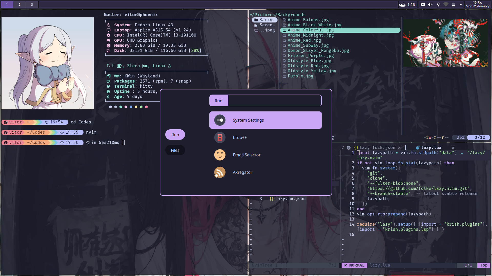

# Configurações do Fedora

Para a customização do Fedora, utilizei basicamente os dotfiles do <a href="../Arch-Linux/README.md">Arch Linux</a>. Entretanto, várias modificações foram necessárias para adaptá-lo aos critérios de funcionamento do Sway - algumas alterações estéticas foram realizadas, tendo como base outros ricings do Reddit.

 

> [!NOTE]
> Devido a questões diversas, sobretudo relacionado ao tempo de ajuste das configurações com o Sway, resolvi voltar para o Fedora com o KDE e customizá-lo diretamente. Dessa forma, utilizei o Rofi para launcher dos programas, Panel Colorizer para a barra e principalmente Krohnkite para TWM (instalação direta em **Settings -> Window Management -> KWin Scripts**)

 

## Pré-Visualização

 
