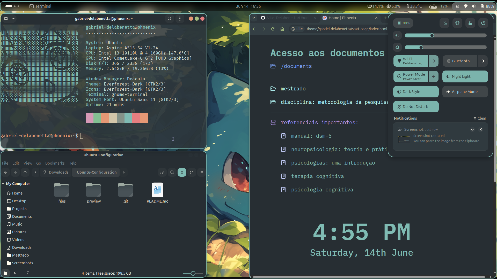
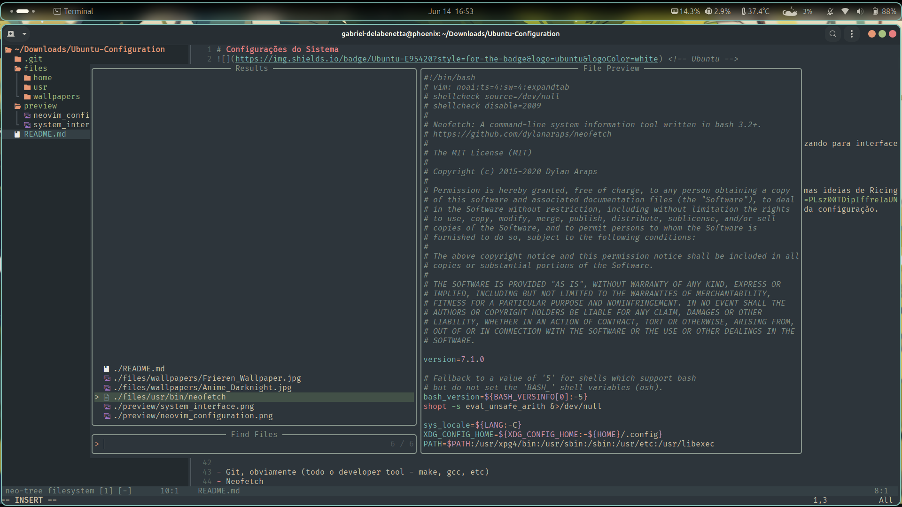

# Gnome

## Configurações do Sistema 

Estas configurações foram realizadas ao longo do tempo através do Gnome Tweaks e do Extension Manager, bem como seguindo algumas ideias de Ricing através do Reddit. 

 

### Pré-Visualização

<i>Imagem de preview das configurações e da interface do sistema</i>

<i>Imagem de preview da interface do Neovim - com o tema Everforest</i>
 

 

## Detalhes da Configuração

> Aplicativos utilizados foram:
> - Nautilus (explorador de arquivos)
> - Terminal do Ubuntu (ou utilizar o Kitty, como fiz no Arch)
> - Firefox (com Vimium, uBlock, Hide Shorts for YouTube)

Para o terminal, foram instalados também os seguintes programas:

- Git (com todo o developer tool - make, gcc, etc)
- Neofetch
- Tree, para poder ver os arquivos em árvore
- No Arch, tenho também o <a href="https://mierak.github.io/rmpc/next/overview/" target="_blank">RMPC</a>, utilizando do MPD (Music Player Daemon)

As extensions instaladas no Gnome Tweaks, foram:

- App menu
- Blur my Shell
- Quick settings tweaks
- Rounded window corners reborn (não é necessário no Hyprland)
- RunCat & Vitals (para o último, estavam configurados para mostrar: temperatura "average"; memória "usage"; processador "usage")
